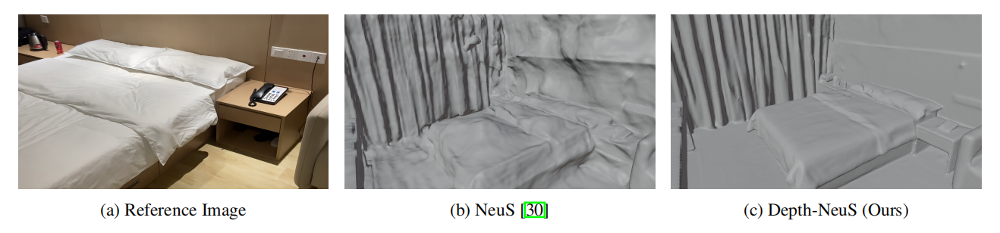

# Depth-NeuS

> By [Hanqi Jiang](https://hq0709.github.io/)




### Data preparation
The data (from scannet) is organized as follows:
```
<scene_name>
|-- cameras_sphere.npz   # camera parameters
|-- image
    |-- 0000.png        # target image for each view
    |-- 0001.png
    ...
|-- depth
    |-- 0000.png        # target depth for each view
    |-- 0001.png
    ...
|-- pose
    |-- 0000.txt        # camera pose for each view
    |-- 0001.txt
    ...
|-- pred_normal
    |-- 0000.npz        # predicted normal for each view
    |-- 0001.npz
    ...
|-- xxx.ply		# GT mesh or point cloud from MVS
|-- trans_n2w.txt       # transformation matrix from normalized coordinates to world coordinates
```


### Setup

```
pip install -r requirements.txt
```

### Training

```
python ./exp_runner.py --mode train --conf ./confs/depth-neus.conf --gpu 0 --scene_name your_scene_name
```

### Mesh Extraction

```
python exp_runner.py --mode validate_mesh --conf ./confs/depth-neus.conf --is_continue
```

### Model Evaluation

```
python ./exp_evaluation.py --mode eval_3D_mesh_metrics
```

### Citation
If you use the code, please cite the following paper:
```
@article{jiang2023depthneus,
  title={Depth-NeuS: Neural Implicit Surfaces Learning for Multi-view Reconstruction Based on Depth Information Optimization},
  author={Hanqi Jiang, Cheng Zeng, Runnan Chen, Shuai Liang, Yinhe Han, Yichao Gao, Conglin Wang},
  publisher={arxiv},
  year={2023}
}
```